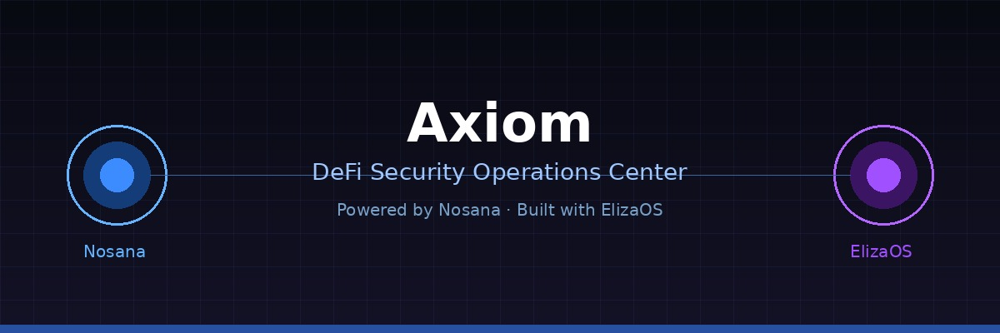
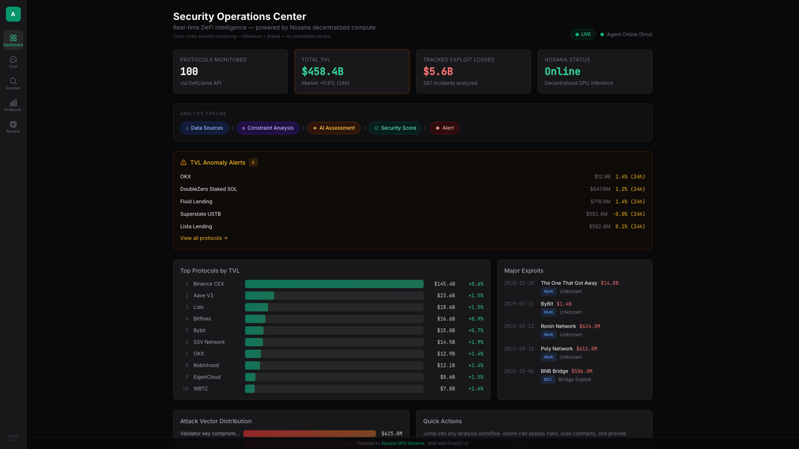
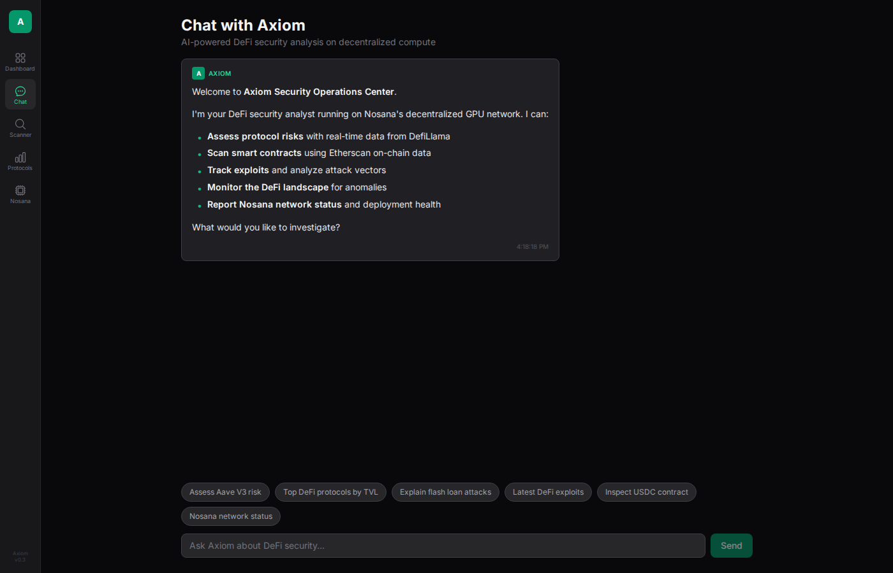
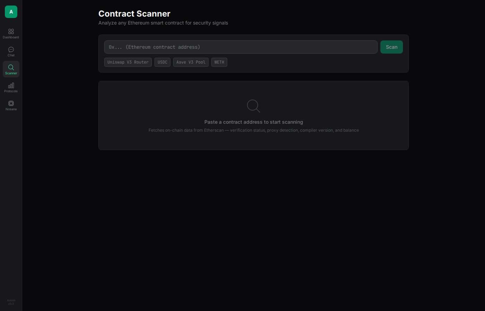
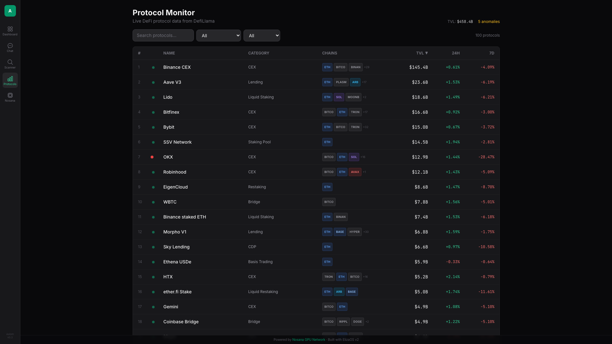
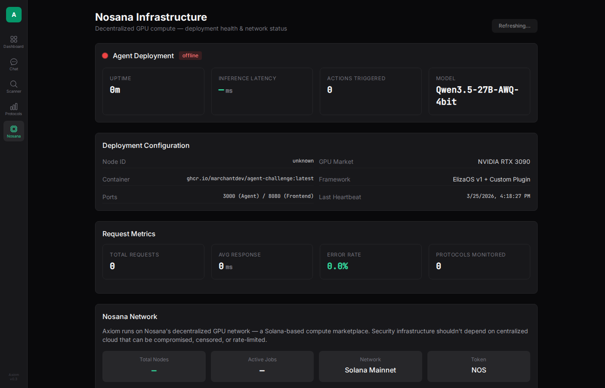

# Axiom — Decentralized DeFi Security Operations Center

> Security infrastructure that's as decentralized as the protocols it protects. Powered by Nosana + ElizaOS.



---

## Demo

> **Demo Video:** [Axiom Demo](demo-video.mp4) — 60s walkthrough of all 5 views

### Screenshots

**Dashboard** — Live TVL stats, exploit timeline, anomaly alerts


**Chat** — Conversation with Axiom, markdown risk reports, suggestion chips


**Scanner** — Paste any ETH/Solana address for instant on-chain inspection


**Protocols** — Searchable/sortable table of top 100 DeFi protocols


**Nosana Status** — Deployment health, NOS price, GPU metrics


---

## Architecture

```
┌───────────────────────────────────────────────────────┐
│                    Nosana GPU Node                     │
│                                                       │
│  ┌─────────────┐    ┌──────────────────────────────┐  │
│  │  React UI   │───▶│     ElizaOS Agent Runtime     │  │
│  │  (port 8080)│◀───│       (port 3000)             │  │
│  │             │    │                                │  │
│  │  Dashboard  │    │  ┌─────────────────────────┐  │  │
│  │  Chat       │    │  │   Axiom Security Plugin  │  │  │
│  │  Scanner    │    │  │   12 Custom Actions       │  │  │
│  │  Protocols  │    │  │                           │  │  │
│  │  Nosana     │    │  │   DefiLlama ←──── TVL     │  │  │
│  │             │    │  │   Etherscan V2 ←── Chain   │  │  │
│  │             │    │  │   Solana RPC ←── Solana    │  │  │
│  │             │    │  │   GitHub    ←──── Repos    │  │  │
│  │             │    │  │   CoinGecko ←── NOS price  │  │  │
│  └─────────────┘    │  └─────────────────────────┘  │  │
│                     │                                │  │
│                     │  Model: Qwen3.5-27B-AWQ-4bit   │  │
│                     └──────────────────────────────┘  │
└───────────────────────────────────────────────────────┘
```

---

## Features

### Custom React Dashboard (5 Views)

- **Dashboard** — Live stat cards, TVL bar chart, exploit timeline, attack vector distribution, TVL anomaly alerts
- **Chat** — Conversation with Axiom agent, markdown rendering, structured risk reports, suggestion chips
- **Scanner** — Paste any Ethereum or Solana address for instant analysis (verification, proxy detection, compiler version)
- **Protocols** — Searchable/sortable table of top 100 DeFi protocols with risk indicators and anomaly badges
- **Nosana Status** — Deployment health, inference metrics, NOS token price, network node count, "Why Decentralized?" section

### 12 Dynamic Actions (Custom ElizaOS Plugin)

| Action | Data Source | Description |
|--------|-------------|-------------|
| `ASSESS_PROTOCOL_RISK` | DefiLlama API + Qwen LLM | Real-time 5-category risk assessment with live TVL, volatility, and AI-generated expert commentary |
| `EXPLAIN_VULNERABILITY` | DeFiLlama Hacks API + Qwen LLM | Explains reentrancy, flash loans, oracle manipulation, bridge exploits — with real verified examples and Solidity code patterns |
| `SCAN_DEFI_TVL` | DefiLlama API | Live TVL rankings across all chains/categories with anomaly detection and 24h/7d change |
| `INSPECT_CONTRACT` | Etherscan V2 + Solana RPC + Qwen LLM | Inspects Ethereum contracts (balance, verification, ERC-20 metadata) and Solana accounts (type, owner program, recent txs) |
| `EXPLOIT_HISTORY` | DeFiLlama Hacks API (478+ records) | Live exploit database — 1h cache, filters by chain/category/technique/year |
| `SCAN_BOUNTIES` | Immunefi Sitemap API | Live bug bounty program scanner sorted by most recent activity |
| `AUDIT_RECON` | GitHub API | Recent commits, audit-file indicators, repo stars and language for any GitHub repository |
| `ANALYZE_WALLET` | Ethplorer (ETH) + Solana RPC + DefiLlama | ETH and Solana wallet risk report — native balance, token holdings, DeFi exposure, risk score |
| `MONITOR_PROTOCOL` | DefiLlama API | Add protocols to a TVL watchlist; alerts when TVL drops >10% since monitoring started |
| `NOSANA_STATUS` | Nosana SDK (Solana on-chain) + CoinGecko | Live deployment health, memory usage, NOS token price, network node/job counts via Nosana SDK |
| `COMPARE_PROTOCOLS` | DefiLlama API | Side-by-side security comparison of two protocols with scored breakdown and AI analysis |
| `GENERATE_AUDIT_REPORT` | DefiLlama + Etherscan + Immunefi + rekt.news + AI | Full audit report orchestrating all data sources into a scored security report with AI risk assessment and recommendations |

### Cross-Chain Support

Axiom operates across **Ethereum** and **Solana** natively:

- **Ethereum** — Contract inspection via Etherscan V2, ERC-20 metadata, ETH wallet analysis via Ethplorer
- **Solana** — Account inspection via Solana JSON-RPC (`getAccountInfo`, `getSignaturesForAddress`), SPL token holdings via `getTokenAccountsByOwner`, SOL balance
- **Multi-chain TVL** — DefiLlama data covers Ethereum, Solana, Arbitrum, Base, Polygon, Avalanche, BSC and 50+ chains

### Data Sources

| Source | Used By |
|--------|---------|
| **DefiLlama API** (`api.llama.fi`) | TVL rankings, protocol metadata, exploit history, protocol watchlist |
| **Etherscan V2 / Ethplorer** | ETH wallet balances, ERC-20 token data |
| **Etherscan V2** | Smart contract source verification status |
| **Solana JSON-RPC** | SOL balances, SPL tokens, Solana account inspection |
| **GitHub API** | Repo commits, audit file detection, security posture |
| **CoinGecko API** | NOS token price and market cap |
| **Nosana SDK** | On-chain node counts, active job counts from Solana programs |
| **Immunefi Sitemap** | Live bug bounty program listings |

### Nosana Integration

- **Configured for Nosana GPU inference** (Qwen3.5-27B-AWQ-4bit on NVIDIA RTX 3090)
- **Nosana SDK** — Uses `@nosana/sdk` `Client` to query node and job counts directly from Solana on-chain data
- **Health endpoints** — `/api/health` and `/api/metrics` serving real operational data
- **Network awareness** — Agent reports NOS token price (CoinGecko), node count, and active jobs
- **CI/CD pipeline** — GitHub Actions builds Docker image on every push to `main`

### Health & Metrics Endpoints

```
GET /api/health
{
  "status": "healthy",
  "uptimeSeconds": 84321,
  "inferenceLatencyMs": 342,
  "actionsTriggered": 1847,
  "nosanaNode": "4HXAjRna...",
  "model": "Qwen3.5-27B-AWQ-4bit"
}

GET /api/metrics
{
  "requestsTotal": 2841,
  "requestsByAction": { "ASSESS_PROTOCOL_RISK": 423, ... },
  "avgResponseTimeMs": 1240,
  "errorRate": 0.02
}
```

---

## What You Can Ask Axiom

Talk to Axiom in natural language. Here are example queries for each of the 12 actions:

| Action | Example Query |
|--------|---------------|
| `ASSESS_PROTOCOL_RISK` | "Assess the risk of Aave V3" |
| `EXPLAIN_VULNERABILITY` | "Explain reentrancy attacks" |
| `SCAN_DEFI_TVL` | "Show top protocols by TVL" |
| `INSPECT_CONTRACT` (ETH) | "Inspect contract 0xA0b86991c6218b36c1d19D4a2e9Eb0cE3606eB48" |
| `INSPECT_CONTRACT` (Solana) | "Inspect GpXHXs5KfzfXbNKcMLNbAMsJsgPsBE7y5GtwVoiuxYvH" |
| `EXPLOIT_HISTORY` | "Show recent DeFi exploits" |
| `ANALYZE_WALLET` | "Analyze wallet 0xd8dA6BF26964aF9D7eEd9e03E53415D37aA96045" |
| `SCAN_BOUNTIES` | "Show active bug bounties" |
| `AUDIT_RECON` | "Audit recon on https://github.com/aave/aave-v3-core" |
| `NOSANA_STATUS` | "Show Nosana network status" |
| `MONITOR_PROTOCOL` | "Monitor Aave" then "Check watchlist" |
| `COMPARE_PROTOCOLS` | "Compare Aave and Compound" |
| `GENERATE_AUDIT_REPORT` | "Generate audit report for Uniswap" |

---

## Security Score API

Axiom exposes a programmatic Security Score endpoint. Any agent or service can query Axiom for a protocol's security score without going through the chat interface — making Axiom a composable **security oracle**.

Axiom is a composable security oracle on Nosana's decentralized compute network. Other agents can query it for protocol safety scores before making DeFi decisions — enabling agent-to-agent security verification on decentralized infrastructure.

```
GET /api/security-score/:protocol
```

**Example:**
```bash
curl http://your-axiom-deployment/api/security-score/aave
```

**Response:**
```json
{
  "protocol": "Aave V3",
  "slug": "aave-v3",
  "tvl": 12500000000,
  "score": 87,
  "components": {
    "tvlStability": 25,
    "verification": 25,
    "maturity": 25,
    "exploitHistory": 12
  },
  "label": "Low Risk",
  "color": "🟢",
  "timestamp": "2026-03-25T21:00:00.000Z"
}
```

**Score Components (each 0–25, total 0–100):**

| Component | What it measures |
|-----------|-----------------|
| `tvlStability` | 24h/7d TVL change — large swings signal instability |
| `verification` | Etherscan source code verification status |
| `maturity` | Time since DefiLlama listing — older = more battle-tested |
| `exploitHistory` | Cross-referenced against DefiLlama /hacks database |

**Score Labels:** 🟢 Low Risk (80–100) · 🟡 Moderate (60–79) · 🟠 Elevated (40–59) · 🔴 High Risk (0–39)

### Badge Endpoint

Embed a live security score badge in any README or dashboard:

```
GET /api/security-score/:protocol/badge
```

Returns a `shields.io`-style SVG badge with the protocol's real-time security score.

**Example:**
```bash
curl http://your-axiom-deployment/api/security-score/aave/badge
```

**Embed in a README:**
```markdown

```

The badge right-hand color reflects the score band: green (≥80), amber (≥60), orange (≥40), red (<40).

This endpoint enables Axiom to act as infrastructure that other agents can query for protocol safety data.

### Agent-to-Agent Integration

Axiom is designed as composable security infrastructure on Nosana's decentralized compute network. Any agent — whether another ElizaOS plugin, a trading bot, or a monitoring service — can query Axiom's Security Score API before interacting with a DeFi protocol.

This enables agent-to-agent security verification: the trading agent handles execution, Axiom handles safety assessment. Each runs independently on Nosana's decentralized GPU network.

```typescript
// Example: A DeFi trading agent checks protocol safety before executing
const response = await fetch('https://axiom.nosana.ci/api/security-score/uniswap');
const { score, label } = await response.json();

if (score < 60) {
  console.log(`Protocol rated ${label} (${score}/100) — aborting trade`);
  return;
}

// Protocol passes safety check — proceed with trade
await executeTrade(params);
```

---

## Quick Start

### Local Development

```bash
# Clone
git clone https://github.com/marchantdev/agent-challenge.git
cd agent-challenge

# Install dependencies
pnpm install
cd frontend && npm install && cd ..

# Configure environment
cp .env.example .env
# Edit .env with your API keys

# Run
pnpm dev
```

### Docker Build

```bash
docker build -t axiom .
docker run -p 3000:3000 -p 8080:8080 --env-file .env axiom
```

### Deploy to Nosana

```bash
# Get builders credits at nosana.com/builders-credits
nosana job post \
  --file ./nos_job_def/nosana_eliza_job_definition.json \
  --market nvidia-3090 \
  --timeout 300
```

---

## Project Structure

```
├── frontend/               # React dashboard (Vite + TypeScript + Tailwind)
│   └── src/
│       ├── components/     # Dashboard, Chat, Scanner, Protocols, NosanaStatus
│       ├── lib/            # API client, types
│       └── styles/         # Tailwind globals
├── src/                    # ElizaOS agent plugin
│   ├── actions/            # 12 custom actions (each in own file)
│   ├── types/              # Shared TypeScript interfaces
│   ├── utils/              # Shared API helpers (formatUsd, cachedFetch, ethRpc, solanaRpc)
│   ├── character.ts        # Axiom character definition
│   ├── plugin.ts           # Plugin registration
│   ├── server.ts           # Frontend server + proxy + health endpoints
│   └── index.ts            # Project entry point
├── characters/             # Character JSON (agent.character.json)
├── nos_job_def/            # Nosana job definition
├── .github/workflows/      # CI/CD pipeline
├── Dockerfile              # Multi-stage build (frontend + agent)
└── README.md
```

---

## Why Decentralized Security Infrastructure?

Security tooling running on centralized cloud has a single point of failure. If the provider is compromised, rate-limits your API, or censors your analysis — the tool stops working.

Axiom runs on Nosana's decentralized GPU network — a Solana-based compute marketplace of independent node operators. This provides:

- **Censorship resistance** — No single entity can shut down or restrict security analysis
- **Trust minimization** — No centralized infrastructure to compromise
- **Always available** — GPU compute sourced from a marketplace; if one node goes down, jobs migrate

> The same trustless ethos as the DeFi protocols it protects.

---

## Deployment

- **Docker Image:** `ghcr.io/marchantdev/agent-challenge:latest`
- **CI/CD:** GitHub Actions auto-builds on push to `main`

---

## Tech Stack

| Layer | Technology |
|-------|-----------|
| Agent Framework | ElizaOS v2 |
| LLM | Qwen3.5-27B-AWQ-4bit (via Nosana GPU) |
| Frontend | React 19 + Vite 6 + TypeScript + Tailwind CSS |
| Compute | Nosana decentralized GPU (RTX 3090) |
| Nosana SDK | `@nosana/sdk` for on-chain node/job queries |
| APIs | DefiLlama, DeFiLlama Hacks, Etherscan V2, Solana RPC, CoinGecko, GitHub, Immunefi |
| Container | Docker (multi-stage build) |
| CI/CD | GitHub Actions |

---

Built by [marchantdev](https://github.com/marchantdev) for the **Nosana x ElizaOS Builder Challenge 2026**.
